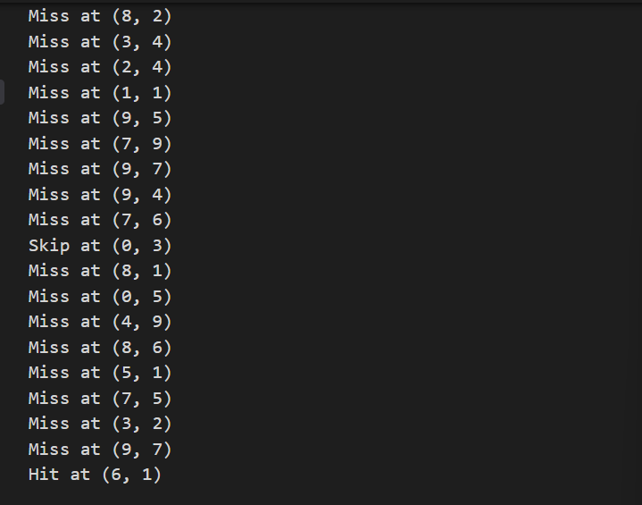
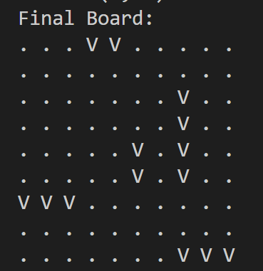

# Submarine Destruction Game

## Project Authors
- Sarit Neugerashel
- Chaya Gutman
- Shira Rosen
- Orit Valdimirsky

## Project Description
The project simulates a board game where participants attempt to destroy submarines randomly placed on a 10x10 grid. The game utilizes threads to simulate player actions and uses a memory-mapped log file (mmap) to document game moves. The game concludes when all submarines are destroyed.

## Key Features
- 10x10 game board
- Random submarine placement
- Multi-threaded gameplay
- Memory-mapped logging mechanism

## Prerequisites
- Docker Desktop installed

## Running Instructions
1. Open the `submarine.c` file
2. Run the following commands in the terminal (in sequence):
   ```bash
   docker run -it --rm -v "<local file path>:/app/submarine.c" memory_mapped_io_demo
   gcc -o submarine submarine.c
   ./submarine
   ```

## Output
- Game log file: `game_log.txt` (located in the `submarine.c` directory)

## Documentation Images



## Note
This project demonstrates the use of memory-mapped I/O (mmap) for logging game events.
